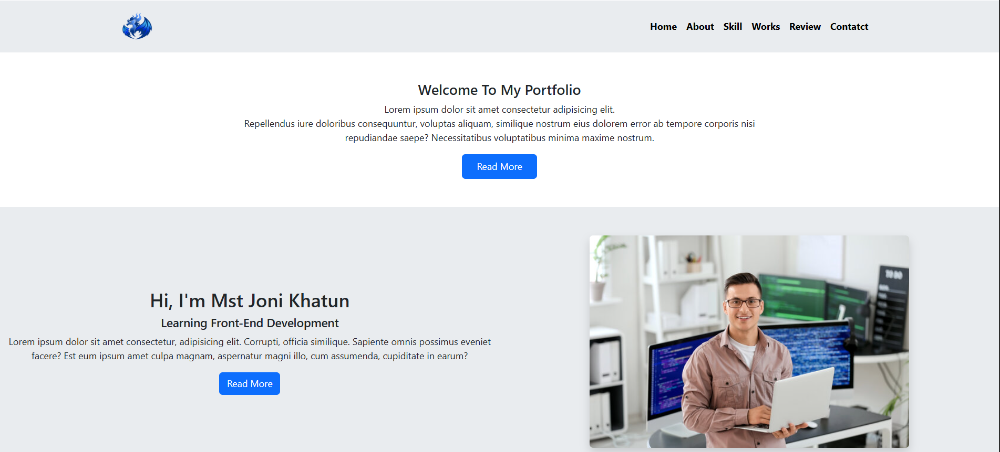

# responsive-portfolio-website-HTML5-BootStrap5

# 🚀 Responsive Website With BootStrap

### Modern • Clean • Responsive • User-Friendly

A beautifully crafted responsive website built with **HTML5**, **CSS3**, and **Bootstrap 5**.  
Designed with a clean layout, smooth user experience, and fully responsive design across all devices.

 

---

# ✨ Features

✔️ Fully Responsive Layout

✔️ Modern & Elegant Design

✔️ Mobile-First Approach

✔️ Bootstrap 5 Components

✔️ Smooth User Interface

✔️ Clean & Well-Organized Code

✔️ Cross-Browser Compatibility

✔️ Fast Loading Performance

✔️ Easy to Customize

✔️ Beginner-Friendly Code Structure

---

# 🛠️ Built With

- HTML5
- CSS3
- Bootstrap 5
- Bootstrap Icons
- Google Fonts

---

# 🌐 Live Demo

👉 **Live Preview:**  
https://your-live-demo-link.com

---
---

# 🎯 Project Goal

This project was created to practice modern front-end development and responsive web design while following clean coding principles and providing a great user experience.

---

# 👨‍💻 Developer

### Mst Joni Khatun

💼 Aspiring Front-End Developer
🌍 Bangladesh
💻 Passionate about creating modern and responsive websites.

GitHub:
https://github.com/Joni250

---

# ⭐ Show Your Support

If you like this project,

⭐ Give this repository a **Star**

🍴 Fork it

📢 Share it with others

---

## ❤️ Thanks for Visiting!

**Happy Coding 🚀**

